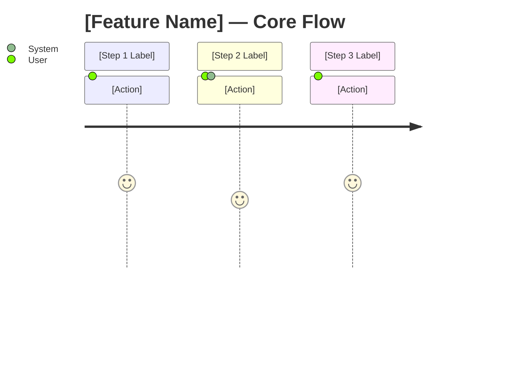
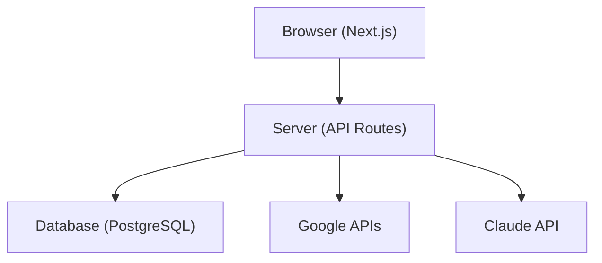
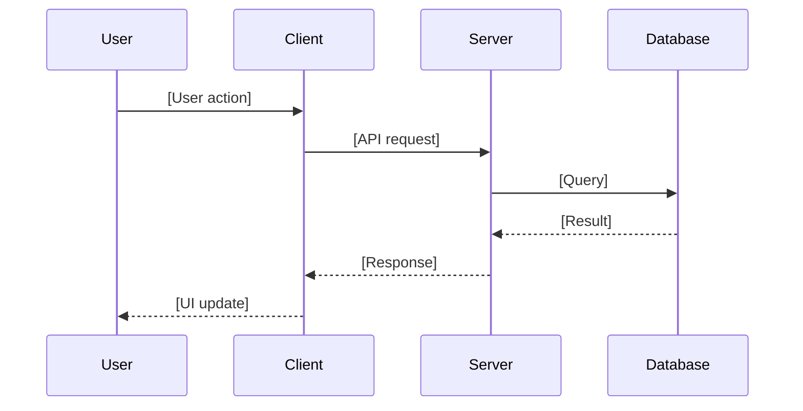
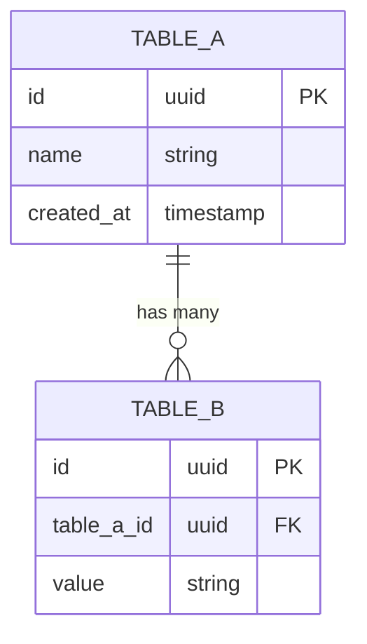

# Documentation Templates

## PRD Template

```markdown
# [Feature Name] — Product Requirements Document

**Status:** Draft | In Review | Approved | Superseded
**Owner:** [Name]
**Last updated:** YYYY-MM-DD

---

## Problem Statement

[1-3 sentences. What problem exists? Who has it? Why does it matter now?]

---

## Target Users

| User Type | Description | Frequency of Use |
|---|---|---|
| [Role] | [What they do] | [Daily / Weekly / Occasional] |

---

## User Journey



---

## Requirements

### Must Have — V1

- [ ] [Requirement 1]
- [ ] [Requirement 2]
- [ ] [Requirement 3]

### Should Have — V1.1

- [ ] [Requirement 4]
- [ ] [Requirement 5]

### Won't Have (and why)

| Feature | Reason Excluded |
|---|---|
| [Feature] | [Out of scope / too complex / future phase] |

---

## Success Metrics

| Metric | Baseline | Target | How Measured |
|---|---|---|---|
| [Metric name] | [Current] | [Goal] | [Tool / query] |

---

## Constraints

- **Technical:** [e.g., must work within existing auth system]
- **Timeline:** [e.g., must ship before Q3 planning]
- **Dependencies:** [e.g., requires data pipeline from data team]

---

## Open Questions

| Question | Owner | Due |
|---|---|---|
| [Question] | [Name] | [Date] |
```

---

## Tech Spec Template

```markdown
# [Feature Name] — Technical Specification

**Status:** Draft | In Review | Approved
**Last updated:** YYYY-MM-DD
**Source of truth:** Codebase (this doc describes as-built behavior)

---

## Overview

[2-4 sentences. What does this system do? What problem does it solve? What are the key design decisions?]

---

## Architecture



---

## Data Flow



---

## Components

| Component | Location | Responsibility |
|---|---|---|
| [Component name] | `src/path/to/file` | [What it does] |

---

## Core Logic

[Pseudocode — numbered steps describing the algorithm. NO code snippets.]

1. Receive [input] from [source]
2. Validate [field] — reject if [condition]
3. Query [table] for [records] where [condition]
4. For each [item]: apply [transformation]
5. Return [output] to [destination]

---

## Data Model



---

## API Endpoints

| Method | Path | Auth | Request Body | Response |
|---|---|---|---|---|
| GET | `/api/[resource]` | Required | — | `{ data: [...] }` |
| POST | `/api/[resource]` | Required | `{ field: value }` | `{ id, ...fields }` |
| PATCH | `/api/[resource]/:id` | Required | `{ field: value }` | `{ id, ...fields }` |
| DELETE | `/api/[resource]/:id` | Required | — | `{ success: true }` |

---

## Environment Variables

| Variable | Required | Description |
|---|---|---|
| `VARIABLE_NAME` | Yes | [What it's for, where to get it] |

---

## Risks & Mitigations

| Risk | Likelihood | Impact | Mitigation |
|---|---|---|---|
| [Risk description] | Low / Med / High | Low / Med / High | [How we handle it] |
```

---

## ADR Template

```markdown
# ADR-NNN: [Decision Title]

**Status:** Accepted | Superseded by ADR-NNN
**Date:** YYYY-MM-DD
**Deciders:** [Names or roles]

---

## Context

[1-3 sentences. What situation forced this decision? What constraints existed?]

---

## Decision

[1-2 sentences. Exactly what was decided.]

---

## Reasoning

[3-5 bullet points explaining why this option was chosen over alternatives.]

- [Reason 1]
- [Reason 2]
- [Reason 3]

---

## Alternatives Considered

| Option | Pros | Cons | Why Not Chosen |
|---|---|---|---|
| [Option A] | [Pros] | [Cons] | [Reason] |
| [Option B] | [Pros] | [Cons] | [Reason] |

---

## Consequences

**Positive:**
- [Good outcome 1]
- [Good outcome 2]

**Negative:**
- [Trade-off 1]
- [Trade-off 2]
```

---

## Folder Structure

```
project/docs/
├── PRD.md
├── TECH-SPEC.md
└── decisions/
    ├── 001-database-choice.md
    └── 002-auth-strategy.md
```

---

## Lifecycle Rules

| Document | How to Update | Source of Truth |
|---|---|---|
| PRD | Trust user's stated change directly. No code verification needed. | User (intent document) |
| Tech Spec | Verify against codebase before editing. Update to reflect as-built reality. | Codebase (as-built) |
| ADR | NEVER modify. Create a new superseding ADR and mark old one "Superseded by ADR-NNN". | Historical record |
