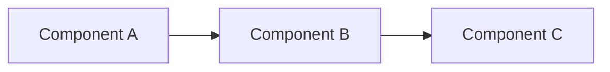

# {TICKET_ID}: {TICKET_SUMMARY}

## Description

[{TICKET_ID}]({JIRA_URL})

{Brief description of the user story and what needs to be accomplished}

## Approach

{A brief overview of the approach — 3-5 sentences covering:
- What's the high-level strategy?
- Why this approach over alternatives?
- Key design decisions}

- {Key decision point 1 and rationale}
- {Key decision point 2 and rationale}

{Optional: Include a mermaid diagram to visualize the data flow, architecture change, or request path}



## Task List

- Task 1: {Clear, actionable title}
  - Status: "NOT STARTED"
  - Scope: {which files/modules are affected}
  - Description: {what to do, which patterns to follow, expected behavior}
  - Acceptance: {how to verify this task is done correctly}

- Task 2: {Clear, actionable title}
  - Status: "NOT STARTED"
  - Scope: {which files/modules are affected}
  - Description: {what to do}
  - Acceptance: {how to verify}

- Task N: Write tests
  - Status: "NOT STARTED"
  - Scope: {test file locations}
  - Description: {what scenarios to test, edge cases}
  - Acceptance: {all tests pass}

## Data Shapes

{New or modified data structures in plain pseudo-code}

```
EntityName:
  id: string (UUID)
  name: string
  status: enum (active, inactive)
  metadata: { key1, key2 }
```

## Behavioral Spec

{Expected behavior in WHEN/IF/THEN pseudo-code}

```
WHEN user performs action
  VALIDATE required fields
  IF validation fails
    RETURN error with field-level messages
  PROCESS the request
  IF success
    RETURN transformed response
  ELSE
    LOG error with context
    RETURN appropriate error code
```

## Risks

- {Risk 1}: {mitigation strategy}
- {Risk 2}: {mitigation strategy}
