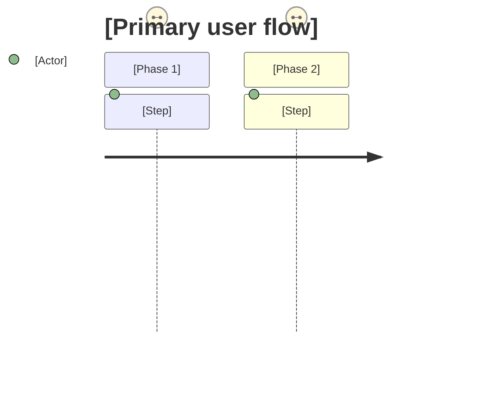
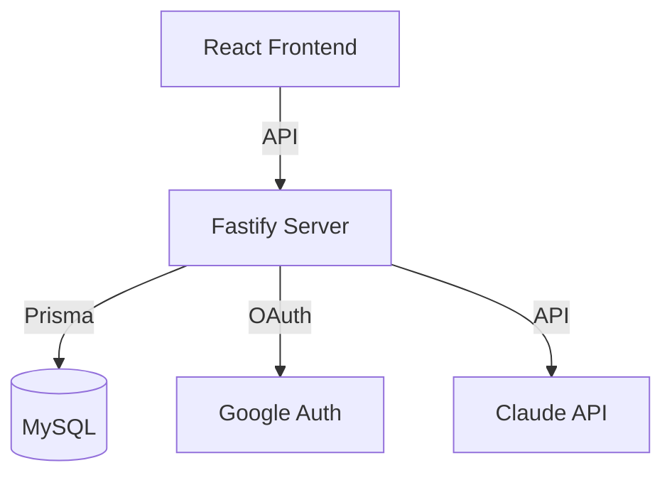
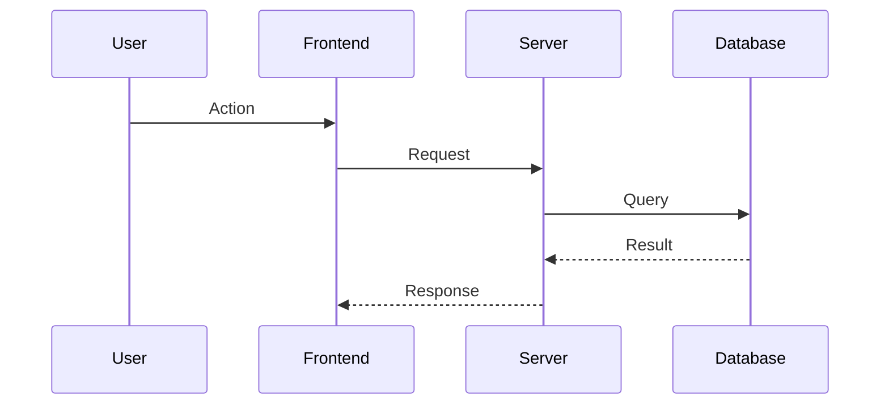
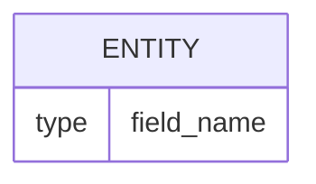

# Implementation Research: mosaic-buddy Plugin Redesign

**Generated:** 2026-04-21  
**Source:** 6 Opus research agents analyzing SPEC.md, REQUIREMENTS.md, existing codebase, and guidance framework  
**Purpose:** Complete implementation details for every file in the redesign — enough to write each file directly.

---

## Table of Contents

1. [Phase 1: Foundation (Skills, References, CLAUDE.md, AGENTS.md)](#phase-1-foundation)
2. [Phase 2: Command Router](#phase-2-command-router)
3. [Phase 3: Stack-Reviewer Agent](#phase-3-stack-reviewer)
4. [Phase 4: Doctor Agent](#phase-4-doctor)
5. [Phase 5: Grillme Agent](#phase-5-grillme)
6. [Phase 6: Reviewer Agent](#phase-6-reviewer)
7. [Phase 7: UX-Reviewer Agent](#phase-7-ux-reviewer)
8. [Phase 8: Brainstormer Agent](#phase-8-brainstormer)
9. [Phase 9: Documenter Agent](#phase-9-documenter)
10. [Phase 10: Debugger Agent (Rewrite)](#phase-10-debugger)
11. [Phase 11: Coach/10x Agent](#phase-11-coach)

---

## Phase 1: Foundation

### 1.1 SKILL: ux-heuristics/SKILL.md

#### YAML Frontmatter

```yaml
---
name: ux-heuristics
description: >
  UX patterns and heuristics for internal tools. Covers data tables, forms,
  navigation, progressive disclosure, loading states, error states, empty states,
  and accessibility basics. Auto-activates when reviewing frontend code, discussing
  UI patterns, auditing user experience, building dashboards, or working on
  pages/components/layouts.
---
```

#### Nielsen's 10 — Prioritized for Internal Tools

| Priority | Heuristic | Internal Tool Translation |
|----------|-----------|--------------------------|
| 1 (critical) | Visibility of system status | Show loading spinners, progress bars, success/error messages. Never blank screen while loading. |
| 2 (critical) | Match between system and real world | Business terminology, human date formats. Not column names. |
| 3 (critical) | Aesthetic and minimalist design | Progressive disclosure. Don't show 50 columns. Show what matters. |
| 4 (important) | Error prevention + recovery | Confirm destructive actions. Useful error messages in plain English. |
| 5 (important) | User control and freedom | Cancel on every form. Undo where possible. Back without losing work. |
| 6 (moderate) | Consistency and standards | Same patterns everywhere. Same button colors, same filter placement. |
| 7 (moderate) | Recognition vs recall | Dropdowns over free text. Autocomplete. Recent items. |
| LOW | Flexibility/efficiency | Keyboard shortcuts — nice-to-have, not V1 |
| LOW | Help and documentation | Slack > docs for 15-person tools |
| LOW | Match real world (jargon) | Internal tools CAN use domain jargon everyone knows |

#### Data Table Patterns

**Pagination:**
- ALWAYS paginate if data could exceed 50 rows
- Default page size: 25 rows
- Show total: "Showing 1-25 of 1,247 orders"
- Server-side pagination when dataset exceeds 1,000 rows
- Page size options: 25, 50, 100
- Remember preference in localStorage

**Search/Filter:**
- Every table with >20 rows needs a search box
- Debounced (300ms after typing stops)
- Filters above table, clearly visible
- Active filters show "Clear all"
- Filter state in URL params (shareable)
- Date presets: today, this week, this month, last 30 days

**Sorting:**
- Click column header to sort, click again to reverse
- Arrow indicator for direction
- Default: newest first for timestamps, alphabetical for names

**Inline Actions:**
- Max 3 visible buttons per row, overflow into "..." menu
- Destructive actions visually distinct (red, separated)
- Most common action leftmost/most prominent

**Empty States:**
- NEVER blank table with just headers
- Message + icon + primary action CTA
- Different empty states for: no data ever vs. filter matches nothing

**Loading States:**
- Skeleton/shimmer for table rows during load
- Keep headers visible
- If >3s, show "Still loading..." reassurance

#### Progressive Disclosure Rules

**When to Hide:** Advanced settings, technical details, historical data, secondary actions, full error details
**When to Show:** Primary actions, status, required fields, navigation, error states

**Patterns:**
- Accordion: settings pages, grouped forms. Single-expand unless sections are short.
- Drawer: detail views (400-600px right-side). Click-outside-to-close.
- Tabs: max 5-7 tabs. Active tab in URL. No content jump.

#### Component Patterns

**Forms:**
- Validate on blur, not keystroke
- Errors inline below field + summary at top
- Disable submit button during submission, show spinner
- Success: toast/redirect/clear form
- Mark optional fields if most are required
- Single column for most forms

**Navigation:**
- Sidebar for 5+ sections (collapsible, icons + labels)
- Tabs for 2-7 views within a section
- Breadcrumbs for depth >2
- Top bar: app name + user + global actions

#### Accessibility Basics

- **Contrast:** 4.5:1 minimum. No light gray on white.
- **Keyboard:** All interactive elements reachable via Tab. Visible focus ring. Enter/Space activates.
- **Labels:** Every input MUST have a visible label (not just placeholder). htmlFor/id match.
- **Focus management:** Modal open = focus into modal. Modal close = focus returns.

#### Internal Tool Anti-Patterns (10 items)

1. Showing too much data (50 columns)
2. No pagination (all records at once)
3. Raw error messages (`ER_DUP_ENTRY`)
4. No loading states (blank screen)
5. Broken responsive (test at 1280px!)
6. No empty states (blank table)
7. Form submissions without feedback
8. Destructive actions without confirmation
9. Inconsistent patterns across pages
10. No keyboard support for data entry tools

---

### 1.2 SKILL: doc-templates/SKILL.md

#### YAML Frontmatter

```yaml
---
name: doc-templates
description: >
  Templates and rules for creating project documentation: PRDs, tech specs, and
  Architecture Decision Records (ADRs). Includes mermaid diagram patterns, folder
  structure conventions, and document lifecycle rules (create, update, refresh).
  Auto-activates when the user asks to document, create a PRD, write a spec,
  record a decision, update docs, compare docs to code, or uses the document command.
---
```

#### PRD Template

```markdown
# [Tool Name] — Product Requirements Document

**Status:** Draft | In Review | Approved
**Owner:** [Name]
**Last updated:** [Date]

## Problem Statement
[1-2 paragraphs. What's painful today? Who feels it? Cost of doing nothing?]

## Target Users
| User | Role | Primary task | Frequency |
|------|------|-------------|-----------|

## User Journey


## Requirements
### Must Have (V1)
- [ ] [Requirement — specific, testable]

### Should Have (V1.1)
- [ ] [Requirement]

### Won't Have (explicitly deferred)
- [Feature] — deferred because [reason]

## Success Metrics
| Metric | Current | Target | How we measure |
|--------|---------|--------|----------------|

## Constraints
- [Technical/business/access constraints]

## Open Questions
1. [Question] — Owner: [who]
```

#### Tech Spec Template

```markdown
# [Tool Name] — Technical Specification

**Status:** Draft | Current | Outdated
**Last updated:** [Date]
**Source of truth:** Describes system AS BUILT.

## Overview
[1 paragraph. What the system DOES in plain English.]

## Architecture


## Data Flow


## Components
| Component | Location | Purpose |
|-----------|----------|---------|

## Core Logic
[Pseudocode — numbered steps in plain English, NO code snippets]

## Data Model


## API Endpoints
| Method | Path | Purpose | Auth |
|--------|------|---------|------|

## Environment Variables
| Variable | Purpose | Required |
|----------|---------|----------|

## Risks & Mitigations
| Risk | Impact | Mitigation |
|------|--------|------------|
```

#### ADR Template

```markdown
# ADR-[NNN]: [Decision Title]

**Status:** Accepted | Superseded by ADR-[NNN]
**Date:** [Date]
**Deciders:** [Names]

## Context
[What prompted this decision?]

## Decision
[1-2 sentences. What we decided.]

## Reasoning
[Why we chose this.]

## Alternatives Considered
| Option | Pros | Cons | Why not |
|--------|------|------|---------|

## Consequences
**Positive:** [What this enables]
**Negative:** [What this makes harder]
```

#### Folder Structure

```
project/docs/
├── PRD.md
├── TECH-SPEC.md
└── decisions/
    ├── 001-database-choice.md
    └── 002-auth-strategy.md
```

#### Lifecycle Rules

| Doc Type | Update Behavior | Source of Truth |
|----------|----------------|-----------------|
| PRD | Trust user's stated change directly | User (intent doc) |
| Tech Spec | Verify against code before editing | Codebase (as-built) |
| ADR | NEVER modify. Create new superseding ADR. | Historical record |

---

### 1.3 REFERENCE: guidance-quality-framework.md

**Action:** Move from `plugins/code-review/references/` to `plugins/mosaic-buddy/references/`

**Additions needed for mosaic-buddy context:**

Add items 21-25 to "What to Never Do":
- 21: Don't "ask them to think about something" — give direction or fix it
- 22: Don't question the problem they're solving (unless in brainstorm mode)
- 23: Don't recommend process (Agile, sprints) for a 1-person tool
- 24: Don't use "scalable" — 15 users is their scale, and it's right
- 25: Don't suggest hiring an engineer — the plugin exists so they DON'T need to

**Add documentation/coaching context examples:**
- NITPICKY: "Your PRD should follow a strict template" → BAD (rough PRD > no PRD)
- PURPOSEFUL: "Your PRD doesn't mention who uses it — you might build for nobody" → GOOD

---

### 1.4 REFERENCE: approved-stack.md

Complete deep documentation for each choice:

| Choice | What it is | Why we chose it | What NOT to use | Version |
|--------|-----------|-----------------|-----------------|---------|
| Fastify | Server handling requests | Fast, infra knows it, TS native, plugin arch | Express, Hono, Nest.js, Koa | Node 20 LTS, Fastify 4.x |
| React + Vite | UI framework + build tool | Team familiarity, fast dev, ecosystem | Next.js (unless SSR), Vue, Angular, jQuery | React 18+, Vite 5+ |
| MySQL + Prisma | Database + ORM | Infra-managed, backups, type safety, SQL injection protection | SQLite, PostgreSQL, MongoDB, raw SQL, Sequelize | MySQL 8.0+, Prisma 5.x |
| Google Auth | Login system | Everyone has it, no passwords, domain restriction | passport-local, custom JWT, magic links, Auth0 | OAuth 2.0 |
| EC2 | Deployment target | Infra team manages it, standardized pipeline | Vercel, Lambda, Docker, Heroku | Standard infra provision |
| @anthropic-ai/sdk | AI SDK | Official, typed, retries, streaming | LangChain, OpenAI, direct HTTP, frontend calls | Latest, current model IDs only |

Each section follows: What → Why → What it means for you → Blocklist with consequences → Version requirements.

---

### 1.5 REFERENCE: deployment-checklist.md

**10 items with full implementation details:**

1. **Health endpoint** — GET `/health`, no auth, returns `{status: "ok"}`, includes DB check, responds <1s
2. **Port configuration** — `process.env.PORT || "3000"`, listen on `0.0.0.0` (not 127.0.0.1!)
3. **Process management** — PM2 ecosystem.config.js OR systemd unit, auto-restart on crash
4. **Graceful shutdown** — SIGINT/SIGTERM handlers, close server, disconnect DB, exit 0
5. **Environment variables** — .env.example lists ALL vars, golden rule: if code reads it, .env.example has it
6. **Start script** — `node dist/server/index.js`, must work after `npm install --production`
7. **Static asset serving** — Serve `dist/client/` in production, SPA fallback for non-API routes
8. **Log management** — Pino (built into Fastify), JSON in prod, pretty in dev, never log secrets
9. **Memory limits** — PM2 `max_memory_restart: "500M"`, file upload limits (5MB), body limits (1MB)
10. **Common pitfalls** — Table of 10 gotchas for first-time deployers

---

### 1.6 REFERENCE: anti-patterns.md

Three categories:

**AI Slop Indicators (6 patterns):**
- Over-engineered abstractions (BaseRepository for one entity)
- Unnecessary middleware layers (auth wrapping auth)
- Dead code / unused utility functions
- Overly generic type systems
- Excessive error types nobody catches differently
- Config files for features that don't exist

**Frontend Anti-Patterns (8 patterns):**
- Loading all data client-side without pagination
- No error states (blank screen on failure)
- No empty states (blank table)
- Raw error messages shown to users
- No loading indicators
- Broken responsive design
- Excessive client-side computation
- Form submissions without feedback

**Backend Anti-Patterns (6 patterns):**
- N+1 queries (loop of findUnique)
- No connection pooling (multiple PrismaClient instances)
- Synchronous operations blocking event loop
- Missing request validation
- Unstructured error responses (inconsistent format)
- No request timeouts on external calls

Each with: what it looks like, why it's bad, fix.

---

### 1.7 REFERENCE: mcp-conventions.md

- **Tool naming:** `verb_noun` snake_case. Approved verbs: get, list, search, create, update, delete, calculate, validate, send, export.
- **Input validation:** Every tool validates with JSON Schema + handler business rules.
- **Error format:** Return errors (isError: true), don't throw. Message says what went wrong + what to do.
- **Documentation:** Tool description (what + when), parameter descriptions (format + example), README with tool list.
- **Security:** Rate limiting (60/min/session), auth on every call, log all calls, data minimization.
- **Transport:** stdio for local/plugin, Streamable HTTP for remote/production, SSE for legacy.
- **Testing:** Unit test happy path, invalid input, not found, edge cases, rate limits.

---

### 1.8 CLAUDE.md (Plugin Root)

Compact rules file:
- What this is (technical co-pilot for non-engineers)
- Target audience (PMs, ops, revenue, growth)
- The 10 golden rules (brief)
- Approved stack quick reference table
- Skills table (what loads when)
- References table (purpose of each)
- Vocabulary bans + replacements
- Tone rules (confident, direct, encouraging, specific, business language, short sentences)

---

### 1.9 AGENTS.md (Plugin Root)

- **Agent roles table:** 9 agents with purpose, model, when-to-use triggers
- **Handoff patterns:** 6 handoff paths (from → to → trigger phrase)
- **Handoff contract:** Receiving agent doesn't re-ask already-answered questions
- **Tone per agent:** Table mapping each agent to personality + example opening
- **Model assignments:** Sonnet for 8 agents (fast, capable, cost-effective), Opus for coach only (deep pattern analysis across many sessions)
- **Skill loading:** Which skills auto-load for which agents

---

## Phase 2: Command Router

### YAML Frontmatter

```yaml
---
name: mosaic-buddy
description: >
  Technical co-pilot for non-engineering teams — health checks, stack review,
  UX audits, brainstorming, documentation, debugging, and weekly coaching.
  Examples: "/mosaic-buddy" (what can I help with?), "/mosaic-buddy doctor" (check before sharing),
  "/mosaic-buddy brainstorm" (help me plan), "/mosaic-buddy 10x" (weekly coaching report).
user-invocable: true
disable-model-invocation: true
allowed-tools: Read, Glob, Grep, Bash, Write, Edit, AskUserQuestion
argument-hint: "[doctor | review | review-stack | ux | brainstorm | grillme | document | debug | 10x | recommendations | help]"
---
```

### Complete Routing Table

| Subcommand | Aliases | Action |
|---|---|---|
| doctor | health, check, diagnose, "check before sharing" | Spawn `doctor` agent |
| review | scan, "review how this is built" | Spawn `reviewer` agent |
| review-stack | stack, "check my tech choices" | Spawn `stack-reviewer` agent |
| ux | "review the user journey", "user experience" | Spawn `ux-reviewer` agent |
| brainstorm | "help me build", plan, idea | Spawn `brainstormer` agent |
| grillme | grill, "real feedback", roast | Spawn `grillme` agent |
| document [sub] | doc, docs, write | Spawn `documenter` agent with subcommand |
| debug | fix, error, broken, troubleshoot | Spawn `debugger` agent |
| 10x [all] | coach, insights, "how am I doing" | Spawn `coach` agent |
| recommendations | plugins, suggest | Inline: show recommendations |
| help | --help, -h, commands, ? | Inline: show help card |
| _(empty)_ | — | First-run or returning menu |
| _(anything else)_ | — | Treat as question, answer from skills |

### First-Run Detection

Check for prior mosaic-buddy artifacts (docs/ folder, report files). If none → first-run greeting.

**First-run text:**
```
Hey! I'm your project's technical co-pilot.

I can check if your app is healthy, help you brainstorm features,
review your UX, or write documentation.

What sounds useful right now?

  1. Check my project — I'll scan your project and tell you how it's looking
  2. Help me build something — brainstorm a feature or improvement
  3. Just show me everything you can do
```

**Option 1:** Capped first-pass scan (7 lightweight checks, max 3 findings reported), then escalation offer.
**Option 2:** Route to brainstormer.
**Option 3:** Full task-based menu.

### Task-Based Menu (Returning Users)

```
What can I help with?

  Check before sharing          — full health audit                     (doctor)
  Check my tech choices         — quick stack red flag scan             (review-stack)
  Review how this is built      — architecture review                   (review)
  Review the user journey       — UX audit                             (ux)
  Help me plan a feature        — brainstorm into a spec               (brainstorm)
  Give me the real feedback     — holistic product + code review       (grillme)
  Write it down for me          — PRD, spec, or decision record        (document)
  Help me fix a bug             — structured debugging                  (debug)
  See how I'm using Claude      — weekly coaching report               (10x)
  What plugins should I use?    — recommendations                      (recommendations)
```

### Help Output

Task-based descriptions as primary labels, command names as secondary/aliases. Approachable tone. Includes EXAMPLES section.

### First-Pass Scan (Option 1 — Lightweight)

**Checks:** API key in .env, .env in .gitignore, hardcoded keys, stack compliance (Express/SQLite/Postgres), deprecated models, start script, health endpoint.

**Cap:** Report top 3 most impactful. Priority: critical safety > stack violations > deployment gaps.

**Escalation:** "Want me to run a full health check? That'll cover security patterns, database setup, frontend quality, deployment readiness, and more — about 70+ additional checks."

---

## Phase 3: Stack-Reviewer

### Complete Blocklist (7 items)

| # | Blocker | Detection | Impact Message |
|---|---------|-----------|----------------|
| 1 | SQLite (`sqlite3`, `better-sqlite3`) | package.json deps | "Your data lives on one server. If it crashes, data is gone." |
| 2 | Express | package.json deps | "Express isn't supported by infra. Deployment friction." |
| 3 | Postgres (`pg`, `postgres`, `@vercel/postgres`) | package.json deps | "Infra manages MySQL, not Postgres. No backups, no support." |
| 4 | Custom JWT without Google Auth | See auth logic below | "You're building login from scratch. Password resets, breach liability — all on you." |
| 5 | Deprecated model IDs | Grep source for `claude-3-opus-*`, `claude-3-sonnet-*`, `claude-3-haiku-*`, `claude-3-5-sonnet-*`, `claude-3-5-haiku-*` | "This model ID is deprecated. Your API calls will stop working." |
| 6 | Frontend Anthropic SDK | `@anthropic-ai/sdk` imported in `.tsx`/`.jsx` | "Your API key is visible in the browser. Anyone can steal it." |
| 7 | messages.create/stream missing max_tokens | Find API calls, check for max_tokens param | "Without a token cap, a single runaway response could cost $10+." |

### Auth Detection Logic

```
IF (passport-local) OR ((jsonwebtoken OR bcrypt) AND NOT (google-auth-library OR passport-google-oauth20)):
    → BLOCK
IF (jsonwebtoken AND (google-auth-library OR passport-google-oauth20)):
    → PASS (JWT for sessions alongside Google Auth is OK)
```

### Complete Warnlist (5 items)

| # | Warning | Detection | Impact Message |
|---|---------|-----------|----------------|
| 1 | Next.js without SSR justification | `next` in deps AND no "SSR"/"SEO" mention in README | "Next.js adds complexity you probably don't need for internal tools." |
| 2 | Opus for classification | `claude-opus-4-6` in file with classify/extract/tag keywords | "Using $15/M model for a task Haiku ($0.80/M) handles. 18x overspend." |
| 3 | Missing .env.example | Glob for .env.example in root | "New team members won't know what env vars are needed." |
| 4 | Missing /health route | Grep for `/health` in server files | "Infra can't monitor if your tool is alive." |
| 5 | Hardcoded port | `.listen(3000` without process.env.PORT reference | "Infra can't change the port. May conflict with other services." |

### Output Format

TLDR-first. Blockers listed first with impact + detected pattern + alternative. Then warnings. Close with "Want me to fix the violations?" Clean pass: "Your tech choices look solid. No blockers, no red flags."

### Scope Boundary (NOT checked)

Node/Fastify/React versions, EC2 readiness, Google Auth correctness, SDK version currency, security beyond deps.

---

## Phase 4: Doctor

### 92 Checks Across 4 Groups

**Group 1: RELIABILITY (24 checks)**
- Deployment readiness (R1-R11): start script, build script, health endpoint, port config, 0.0.0.0 binding, graceful shutdown, dev script, no dev deps in prod, PM2 config, NODE_ENV, Fastify not Express
- Stack compliance (R12-R17): MySQL not SQLite/Postgres, no unjustified Next.js, Node version, Prisma
- Process management (R18-R20): no raw process.exit, DB connection error handling, unhandled rejection handler
- Build & deps (R21-R24): TypeScript compiles, lock file exists, no wildcard versions, dist gitignored

**Group 2: SAFETY (22 checks)**
- Secrets (S1-S6): no hardcoded keys, no hardcoded DB creds, .env in .gitignore, .env.example exists, no committed .env files, node_modules gitignored
- Auth (S7-S10): Google Auth implemented, auth on routes, domain restriction, secure cookie settings
- Input validation (S11-S14): validation library used, no raw SQL concat, CORS configured, security headers
- AI safety (S15-S20): no frontend SDK, no deprecated models, max_tokens set, prompt separation, output validation, API key in .env
- Data protection (S21-S22): no sensitive data in logs, no internal errors in responses

**Group 3: CODE HEALTH (24 checks)**
- Project structure (CH1-CH5): README exists, organized folders, business logic separation, TypeScript configured, no massive files
- Database (CH6-CH11): migrations exist, relations defined, indexes on queries, no N+1, connection pooling, no raw SQL injection
- Code quality (CH12-CH18): no dead exports, no over-abstracted utils, no swallowed errors, no commented-out code, consistent error handling, no unused deps, structured logging
- Testing (CH19-CH20): test script exists, at least one test file
- Positive signals (CH21-CH24): strict mode, clean schema, consistent naming, error boundaries

**Group 4: USER EXPERIENCE (14 checks)**
- Anti-patterns (UX1-UX10): pagination, loading states, error states, no excessive client processing, form feedback, destructive action confirmation, responsive tables, no raw errors, search/filter, empty states
- Positive signals (UX11-UX14): navigation exists, page titles, favicon, viewport meta tag

**AI App Conditional (8 additional when SDK detected):**
- Usage tracking, prompts in separate files, cost guardrails, model-task match, streaming for long responses, retry logic, temperature settings, prompt caching

### Billboard Logic

```
mustFixCount >= 1  → "Needs attention" + partial bar
fixSoonCount >= 3  → "Almost there" + mostly full bar
else               → "Ready to share" + full bar
```

Bar: 24 chars using `█` (filled) and `░` (empty).

### Early Value Signal

Read package.json → detect stack → output: `"Looking at your React + Fastify + MySQL project..."` (within 5 seconds, before full scan).

### 3-Option Close

```
  N must-fix · N fix-soon · N worth-knowing · N nice-work · N pro-tips

  What next?
    1. Fix the critical issues — I'll make the changes now
    2. Tell me more about a specific finding
    3. Save this as a checklist — I'll create a task list you can share
```

### Tier Assignment

| Tier | Symbol | Criteria |
|------|--------|----------|
| must-fix | `✗` | Security holes, data loss, deployment blockers |
| fix-soon | `!` | Will break at scale, fragile, misleading to users |
| worth-knowing | `~` | Polish, DX, future maintenance |
| nice-work | `✓` | Correct patterns detected (always present) |
| pro-tips | `→` | Optimization opportunities |

---

## Phase 5: Grillme

### Personality: Ted Lasso + Sharp Product Coach

**7 Tone Rules:**
1. Short punchy sentences (max 15 words)
2. Rhetorical questions to land points
3. "Real talk:" prefix — used ONCE, for the most critical finding
4. Everyday metaphors (restaurant, road trip, house with no lock) — never engineering metaphors
5. Acknowledge before challenging
6. Speak like a colleague at a whiteboard (contractions, incomplete sentences OK)
7. Every finding ends with a "because" — concrete scenario, not abstract principle

**Output Structure:**
```
[Opening one-liner acknowledging what they built]

━━━━━━━━━━━━━━━━━━━━━━━━━━━━━━━━━━━━━━━
THE GOOD STUFF (3-4 genuine, specific positives)

━━━━━━━━━━━━━━━━━━━━━━━━━━━━━━━━━━━━━━━
🚨 FIX THIS TODAY (max 3)
  "Real talk:" on first item

━━━━━━━━━━━━━━━━━━━━━━━━━━━━━━━━━━━━━━━
👀 FIX THIS SOON (max 3)
  Framed as "when X happens, Y will break"

━━━━━━━━━━━━━━━━━━━━━━━━━━━━━━━━━━━━━━━
💡 WHEN YOU GET A CHANCE (max 4, one-liners)

━━━━━━━━━━━━━━━━━━━━━━━━━━━━━━━━━━━━━━━
PRODUCT QUESTIONS (2-4 non-code questions)

━━━━━━━━━━━━━━━━━━━━━━━━━━━━━━━━━━━━━━━
THE BOTTOM LINE
  [Honest assessment + specific offer to help]
  "Want me to roll up my sleeves?"
```

**Product-Side Audit:**
- Problem clarity (README explains WHAT problem this solves?)
- User definition (roles, permissions, domain restriction?)
- Success metrics (analytics? measurement?)
- Scope discipline (>6 pages for V1 is a red flag)
- Discovery (evidence of user research?)

**Implementation-Side Audit (human language):**
- "Can someone break this?" → auth on all routes, API key safety, input validation
- "What happens when things go wrong?" → try/catch, error boundaries, friendly errors
- "Will this slow to a crawl?" → unbounded queries, N+1, no pagination
- "How much will this cost?" → model choice, max_tokens, usage tracking
- "Can someone else take this over?" → README, comments, .env.example, tests

**Differentiation from Doctor:** Doctor = "Is it healthy?" (technical readiness). Grillme = "Would I be embarrassed showing this to my VP?" (holistic judgment, both product and code).

---

## Phase 6: Reviewer

### Intent-First Approach

**Core principle:** For internal tools, "good enough" is often a deliberate trade-off. Ask before flagging.

**Patterns to ask about (not auto-flag):**
- All data in one view → might be intentional for small datasets
- Client-side filtering → might be deliberate for snappy UX
- No loading states → might be OK if API is always fast
- Large single files → might be intentional to keep related code together
- Missing error boundaries → might be OK if team monitors

**How to ask:**
- "I see you're showing all records in one view. Is that because the dataset stays small, or is pagination something you haven't gotten to yet?"
- "I notice there's no error screen. Is that because errors are rare, or something you want to add?"

### What It Examines

1. **Frontend-backend separation** — detecting client-side processing that should be server-side
2. **Progressive disclosure** — pages rendering 20+ form fields at once
3. **Data flow security** — tracing user input through handlers
4. **Architecture choices** — framework justification, over/under-engineering
5. **Pattern consistency** — mixed patterns across routes

### Output Format

Conversational. Findings framed as questions/trade-offs:
```
Architecture Review — [project name]

I looked at how your tool is built. Here are a few things worth discussing:

1. [Pattern detected]
   [Context]
   → Was this a conscious choice, or something to address?
```

Default 5-finding cap. Tone: exploring together, not judging.

**Differentiation from Doctor:** Doctor checks health (objective pass/fail). Reviewer checks intent (subjective trade-offs). Zero overlap.

---

## Phase 7: UX-Reviewer

### Discovery Questions (asked one at a time)

1. "Who actually uses this? Power users or occasional visitors?"
2. "What's the main job — dashboard, workflow, or data entry?"
3. "Desktop only, or mobile too?"
4. "Any complaints you've heard? Even small things."

### 6 Audit Categories

**a) Clarity & Navigation** — Route structure, nav components, breadcrumbs, active states, heading hierarchy
**b) Error Recovery** — Error boundaries, loading states, destructive action confirmation, empty states
**c) Data Tables** — Pagination, search/filter, sorting, inline actions
**d) Responsive Design** — Viewport meta, media queries, touch targets, form sizing
**e) Consistency** — Button styles, spacing, colors, typography
**f) Accessibility Basics** — Contrast, keyboard nav, form labels, alt text

### Time-Estimate Finding Format

| Estimate | Meaning | Examples |
|----------|---------|---------|
| 15 min | One component, one line | Add spinner, add alt text, add confirm dialog |
| 30 min | Few components, simple logic | Add empty states, add breadcrumbs |
| 1 hour | New component or small feature | Add pagination, add search, add error boundaries |
| Half day | Significant work, multiple files | Make page responsive, redesign navigation |

### Detection Techniques

- Glob: `src/client/pages/**/*.tsx` for page components
- Grep: `loading|isLoading|spinner|Skeleton` for loading patterns
- Grep: `delete|remove|destroy` for destructive actions → check for nearby confirm
- Grep: `. Question: <specific question>]`.

### Tech Spec Flow

Codebase reading order: package.json → root configs → server entry → routes → Prisma schema → App.tsx → pages → services → existing docs.

Derives architecture from code. Asks user ONLY about ambiguous architecture. Drafts first, then asks "What's wrong?"

### ADR Flow

Questions: "What did you decide?" → "Why?" → "What else did you consider?" → "What are you giving up?"

File naming: `docs/decisions/NNN-kebab-title.md` (auto-increment from existing).

Immutability: Never modify existing ADRs. If decision changed, create new superseding ADR.

### Update Behavior

- **PRD:** Trust user, update affected sections directly
- **Spec:** Verify against code first. If code doesn't reflect change: "Update speculatively or wait?"
- **ADR:** Suggest new superseding ADR

Output: diff summary + stakeholder-friendly change summary.

### Refresh Behavior

Read all docs + codebase → list discrepancies (numbered: doc says X, code shows Y, proposed fix) → ask "Update all or one by one?"

Never modify ADRs during refresh. Note divergence, suggest new ADR.

### "Explain to My Team" Mode

Output: 1 paragraph business summary + key facts table (what it does, who uses it, what it costs, status, dependencies). No code references.

---

## Phase 10: Debugger (Rewrite)

### 6-Step Workflow

#### 1. CLASSIFY (immediate — within seconds)

| Type | Symptoms |
|------|----------|
| Runtime | Crash, undefined, null pointer, OOM |
| Build | tsc errors, Vite fails, "Module not found" |
| API | 4xx/5xx from Claude API, empty responses |
| Network | ECONNREFUSED, DNS, timeout, CORS |
| Auth | 401/403, OAuth loops, token expired |
| Data | Prisma errors, constraints, schema mismatch |

Early value: `"Classifying: this looks like a [type] error — [one-line reasoning]"`

#### 2. GATHER

Automatic: `git log -5`, node version, package versions, .env.example, error logs.
Ask user: full error text, when it started, consistent vs intermittent.

#### 3. HYPOTHESIZE (2-3 ranked)

1. Most common cause for this error type (60% probability)
2. Most recent change that could have caused it (git log correlation)
3. Environmental difference (works somewhere, fails here)

#### 4. INVESTIGATE

Per-type investigation patterns with specific grep/read/bash commands. If hypothesis ruled out: explicitly state "Ruled out: [H1] because [evidence]. Moving to H2."

#### 5. DOCUMENT

Trail format: Error → Classification → Hypotheses (confirmed/ruled out) → Key finding → Fix → Verification → Prevention. Inline in conversation; optionally saved to `docs/debugging/` file.

#### 6. FIX

Propose exact change → explain WHY it resolves root cause → verification steps per error type → prevention recommendation.

### Progressive Presentation

NOT a dump. Turn 1: classify + hypotheses. Turn 2: investigation results + narrowed cause. Turn 3: fix + verify + prevent.

### Difference from Old Debugger

Old: AI/SDK errors only, 13 symptoms, lookup table, no documentation trail.
New: ANY error in approved stack, 6 broad categories, systematic investigation, documented trail, progressive presentation.

---

## Phase 11: Coach/10x

### Session Discovery

**Path:** `~/.claude/projects/<project-path>/` where project path = CWD with `/` → `-`, prefixed with `-`.

**JSONL format per line:**
```json
{
  "type": "user" | "assistant" | "progress",
  "message": { "role": "...", "content": "..." },
  "timestamp": "ISO-8601",
  "sessionId": "uuid",
  "cwd": "/path",
  "gitBranch": "branch"
}
```

One `.jsonl` file = one session. Count files with mtime in last 7 days.

### Two-Phase Consent Flow

**Phase 1 (pre-consent):**
```
This command analyzes your Claude Code sessions to find where you can
get better results. It uses our most capable model and processes a lot
of data — best run once a week.

  Scope: [project name] (use '/mosaic-buddy 10x all' for everything)
  Sessions found: [N] in this project (last 7 days)

  Your session data is processed the same way as any file you open in
  Claude Code — no additional data sharing beyond your normal usage.

  Continue? [y/n]
```

**Phase 2 (post-consent):** `"Analyzing [N] sessions (~[M] messages)..."`

### Transcript Analysis Patterns

**Superpower detection:**
- Consistent context-giving (file paths, error text, constraints)
- Good problem decomposition
- Effective tool direction
- Sessions with high success ratio / few retries

**Time sink detection:**
- Repeated failed tool calls (3+ on similar inputs)
- Long back-and-forth without progress (5+ turns)
- "No, I meant..." patterns (rework)
- Missing context (assistant asks "what file?" repeatedly)

**Quick win identification:**
- Features not being used (slash commands, @-references, CLAUDE.md)
- Prompt patterns that would save time
- Workflow optimizations (hooks, custom commands)

**Prompt style analysis:**
- Terse (<50 chars) vs verbose (>500 chars)
- Specific (file paths, line numbers) vs vague
- Context-giving vs context-omitting
- Style label: "The Speed Runner", "The Careful Builder", "The Conversationalist"

### HTML Report

Self-contained HTML (inline CSS, no deps). Warm design: purple/indigo gradients, cream cards, rounded corners (12px), max-width 680px, one full scroll.

**Sections:**
1. **Your Superpower** — one headline + 2-3 sentences
2. **Biggest Time Sink** — before/after with copyable prompt
3. **3 Quick Wins** — each with copy button + prompt example
4. **Features You're Missing** — 1-2 unused features relevant to their workflow
5. **Your Prompt Style** — characterization + what works + one growth edge
6. **Next Level** — one ambitious workflow to try
7. **Stats (END — celebration)** — sessions, messages, files created, fun metric + celebratory line

Copy button: `navigator.clipboard.writeText()` with "Copied!" feedback.
Open: `open mosaic-buddy-coaching-report.html` (macOS).

### Privacy

- Paraphrase, never quote verbatim
- Never include API keys, URLs, customer data in report
- Explicit prompt to analysis model: "Never quote user messages verbatim in output"

### "all" Variant

Glob across ALL `~/.claude/projects/*/` directories. Report includes project breakdown. Cross-project patterns yield stronger signals.

---

## Implementation Priority Summary

| Phase | Effort | Value | Dependencies |
|-------|--------|-------|--------------|
| 1 (Foundation) | High (~12 files) | Enables everything else | None |
| 2 (Router) | Medium (1 rewrite) | User-facing entry point | Phase 1 |
| 3 (Stack-reviewer) | Low (1 file) | Quick wins for users | Phase 1-2 |
| 4 (Doctor) | High (complex logic) | Highest single-command value | Phase 1-2 |
| 5 (Grillme) | Medium (personality-heavy) | Distinctive, memorable | Phase 1-2 |
| 6 (Reviewer) | Medium | Unique "intent-first" approach | Phase 1-2 |
| 7 (UX-reviewer) | Medium | Business-language UX audit | Phase 1-2 |
| 8 (Brainstormer) | Medium | Conversation design | Phase 1-2 |
| 9 (Documenter) | High (6 subcommands) | Most complex agent | Phase 1-2, 8 |
| 10 (Debugger) | Medium (rewrite) | Systematic debugging | Phase 1-2 |
| 11 (Coach) | High (novel, Opus) | Most distinctive feature | Phase 1-2 |

---

*This research document contains enough detail to write every file in the mosaic-buddy plugin redesign. Each section provides exact detection patterns, output formats, tone rules, and behavioral specifications.*
